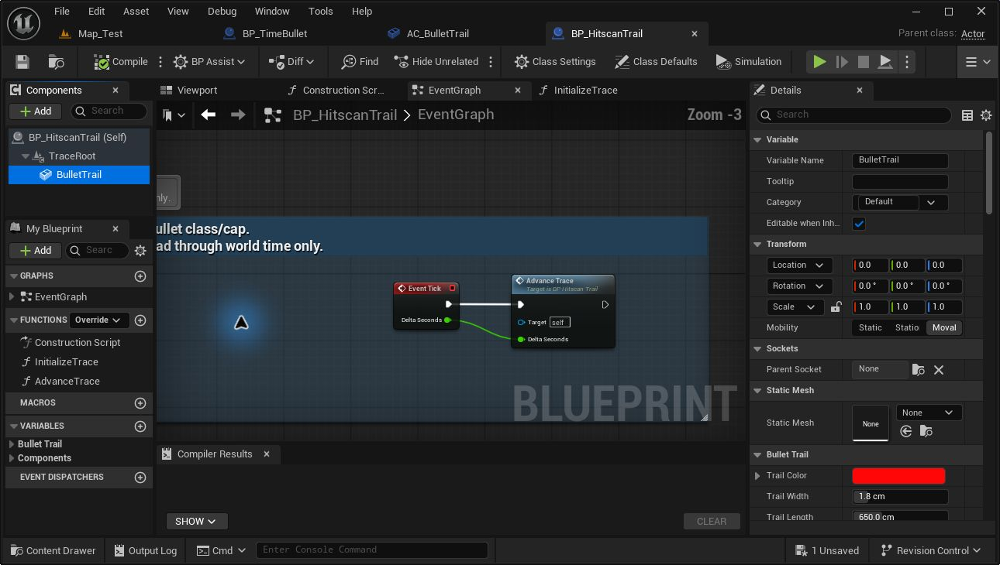
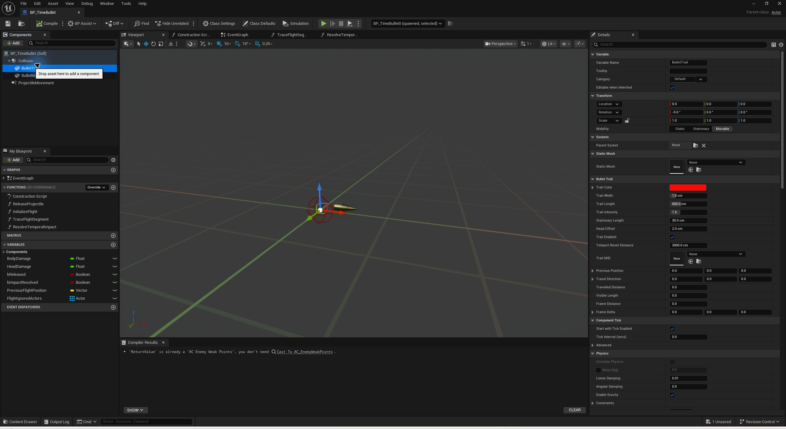
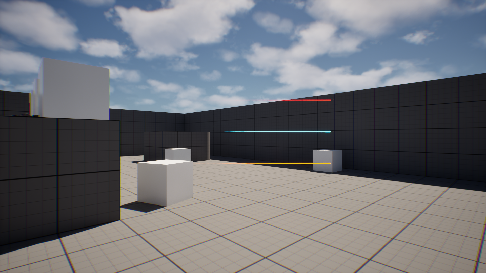
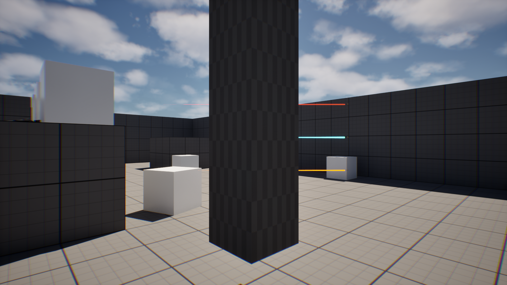
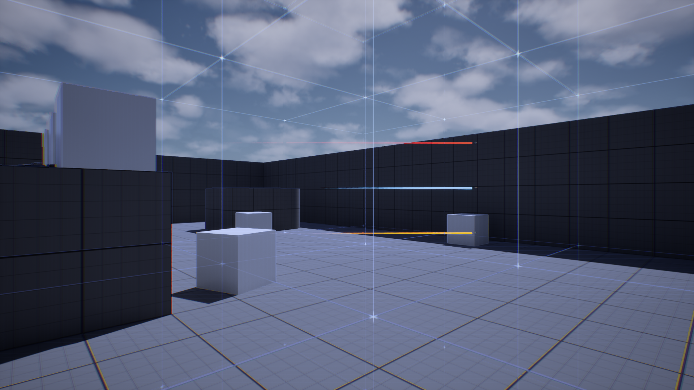
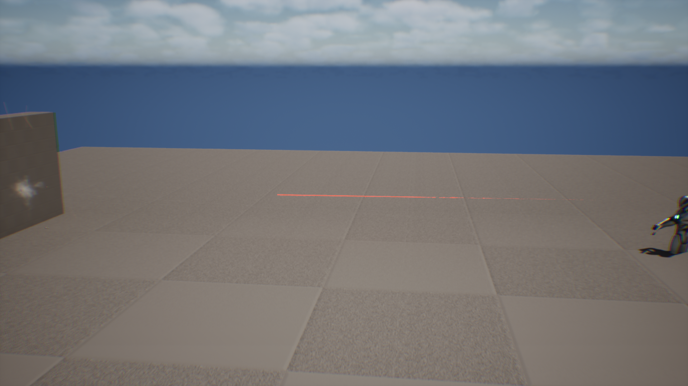

# 玩家子弹拖尾

日期：2026-10-03。引擎：本机 UE 5.6.1。任务关联：TA-017、TA-003、P-052。首版接入 BP_TimeBullet；同日按用户补充要求扩展到 Normal / BulletTime 普通射击。不表示教学敌弹 TA-018 或整个计划项已完成。

## 使用与调节

普通状态和子弹时间的射击拖尾：打开 `/Game/VFX/BulletTrail/BP_HitscanTrail`，选择 **BulletTrail** 组件，在 **Bullet Trail** 分类调节 **Trail Color / Trail Width / Trail Length**。默认同为红色、1.8 cm、最大 650 cm。修改后 Compile、Save，在 PIE 查看。



完全时停的实体弹及其释放后的拖尾，仍使用下面的 BP_TimeBullet 入口；两个蓝图的组件模板可分别覆盖样式。普通射击另有 BP_HitscanTrail 的 Class Defaults → **Visual Speed**（5000 cm/s）和 **Impact Hold Time**（0.04 游戏秒）。速度只影响显示，伤害仍在射线命中时立即结算。BP_Item_Base 的 **Normal Trail Enabled** 默认开启，可在武器子类覆盖；它关闭视觉时仍保留原伤害。

打开 `/Game/Blueprints/Weapons/Player/Projectiles/BP_TimeBullet`，在左侧 Components 中选择 **BulletTrail**，展开 Details 的 **Bullet Trail** 分类。修改后 Compile、Save，再进入 PIE 查看。

| 参数 | 当前默认 | 含义 |
| --- | --- | --- |
| Trail Color | 红色，Linear RGB=(1, 0.002, 0.002) | 点击色块使用颜色选择器；每枚子弹拥有独立动态材质 |
| Trail Width | 1.8 cm | 靠近弹头处的直径；向后连续收尖，0 隐藏 |
| Trail Length | 650 cm | 最大长度；随实际行进距离增长至此上限，0 隐藏 |
| Trail Intensity | 1.5 | 发光颜色倍率；最终外观仍受曝光、色调映射和时停后处理影响 |
| Stationary Length | 30 cm | 最小方向提示长度；新生成且尚未飞行的悬浮弹仍有短尾。设为 0 时只显示已行进的距离 |
| Head Offset | 2 cm | 拖尾头端相对弹丸 Actor 原点向后偏移，避免包住弹头 |
| Trail Enabled | true | 纯视觉开关，不改变子弹运动、碰撞或伤害 |
| Teleport Reset Distance | 3000 cm | 单帧位移超过此值时重置历史，避免瞬移拉出长线 |

下面的 Trail MID、Previous Position、Travel Direction、Travelled Distance、Visible Length、Frame Distance、Frame Delta 是运行状态，不作为美术调参入口。不要用原生 Activate/Deactivate 代替 Trail Enabled。

蓝图编辑器预览窗口中组件的 Static Mesh 为 None 是当前实现的正常状态：组件在 BeginPlay 设置网格并建立材质实例。本版在 PIE/运行时预览，未实现编辑器实时预览。运行中修改该实例的前三个参数会在下一次组件 Tick 刷新；退出 PIE 不保留实例改动。要永久修改，请在上述蓝图组件模板上设置并保存。



## 视觉目标与调查结论

用户提供 SUPERHOT 预告片链接及截图。截图的主要特征为：可辨认的弹头、靠近弹头较粗、沿身后弹道逐渐收尖、饱和红色和清晰连续的轨迹。网页工具未能完整播放该 YouTube 链接，因此本次视觉依据是用户截图，不声称逐帧看完视频，也不声称取得原作工程。

在线核查了 [Epic UE 5.6 Niagara Ribbon 教程](https://dev.epicgames.com/documentation/en-us/unreal-engine/how-to-create-a-ribbon-effect-in-niagara-for-unreal-engine?application_version=5.6)：Ribbon 可连接粒子生成拖尾，外观受宽度、颜色和粒子生命周期控制。另查阅独立开发者 [Connor De Meyer 的 SUPERHOT Remake 介绍](https://connordemeyer.net/posts/super-hot-remake/)，其公开说明使用几何着色器为子弹绘制相邻线段；这是个人复刻的思路，不能当作 SUPERHOT 官方实现。

结合当前 BP_TimeBullet 无重力、直线飞行、先悬浮再释放的实际逻辑，本版采用 **三维收尖网格 + 实际位移驱动长度**。它不依赖粒子寿命，因此暂停/慢动作不会因为寿命流逝而缩短拖尾；环向网格也避免单张平面侧视消失。以后需要弯曲、追踪或弹跳历史时，再改为路径采样 Ribbon 或分段网格。



画面为测试中真实移动后停止的三枚 BP_TimeBullet：上方红色宽 1.8 cm / 长 360 cm，中间青色宽 3.5 cm / 长 220 cm，下方橙黄色宽 2.5 cm / 长 300 cm。正式默认仍为红色、1.8 cm、最大 650 cm。该图是运行截图，不是概念图。

## 保存的资产与运行逻辑

| 资产 | 本次变化 |
| --- | --- |
| `/Game/VFX/BulletTrail/AC_BulletTrail` | 新建 Blueprint，父类为原生 StaticMeshComponent，封装显示与生命周期 |
| `/Game/VFX/BulletTrail/SM_BulletTrailTaper` | 新建 16 边闭合锥体，32 个三角形；X=-100 为尾尖，X=0 为头端，头端直径 100 |
| `/Game/VFX/BulletTrail/M_BulletTrail` | 新建 Unlit / Opaque / Two Sided 材质，Emissive=TrailColor×TrailIntensity，正常深度遮挡 |
| `/Game/Blueprints/Weapons/Player/Projectiles/BP_TimeBullet` | 在 Collision 下添加 BulletTrail 组件；原有全部图表导出逐项比较一致 |

网格源文件见 [SM_BulletTrailTaper.obj](BulletTrail/SM_BulletTrailTaper.obj)。制作阶段使用临时 editor-only 图表工具和 Blueprint Assist；保存资产的运行父类、节点均为引擎原生，不需要制作工具。最终 PIE 在未加载该制作模块的原编辑器中完成。

组件 BeginPlay 禁用自身碰撞和阴影，设置绝对世界变换，建立独立 MID，初始化位置与 Owner 前向。组件在 TG_PostUpdateWork 更新，并以 Owner 为 Tick prerequisite，在弹丸 PostPhysics 飞行/命中逻辑之后读取结果。

每帧计算当前位置减上一位置，位移大于 0.01 cm 时更新方向和累计距离，不积分已经缩放的 DeltaSeconds。单帧位移超过 Teleport Reset Distance，或新旧方向点积小于 0.995 时清零累计距离。静止时保留原方向和长度。

```text
VisibleLength = min(max(TrailLength, 0),
                    max(TravelledDistance, max(StationaryLength, 0)))
WorldScale = (VisibleLength / 100, max(TrailWidth, 0) / 100, max(TrailWidth, 0) / 100)
WorldLocation = OwnerLocation - TravelDirection * max(HeadOffset, 0)
WorldRotation = MakeRotFromX(TravelDirection)
Visible = TrailEnabled && TrailWidth > 0 && VisibleLength > 0
```

组件读取弹丸位置，不修改 ProjectileMovement、命中、伤害、能量、输入和全局时间倍率。命中后仍由原 BP_TimeBullet 销毁自身；Actor 的原生组件所有权同步清理拖尾，无游离粒子或独立拖尾 Actor。

## 首版 BP_TimeBullet 验收证据

指定 PIE 检查共 **50 项通过**：

- [组件与生命周期 36 项](BulletTrail/verify_result.json)：悬浮短尾、实际释放、按距离增长和上限、世界空间粗细、朝向与跟随、0.01 慢动作、静止保持、实时参数、实例隔离、开关、瞬移/转向重置、负值边界、真实场景碰撞销毁、12 枚独立 MID 及清理。
- [正式手枪链路 11 项](BulletTrail/weapon_result.json)：实际拾枪接口和武器 BeginFire/StopFire；FullStop 生成一枚悬浮实体弹，能量跨越阈值进入 BulletTime 后自动释放并增长拖尾，最终恢复 Normal。使用正式玩法调用，不是直接生成子弹代替开火；没有认证物理按键操作。
- [时停组合 3 项](BulletTrail/capture_more_result.json)：切入 FullStop、三种拖尾保持长度、退出恢复 Normal。遮挡与时停画面另做目视检查。





新组件的 4 张图经 Blueprint Assist 尺寸刷新、整理、结构化注释和再次整理；去除纯走线 reroute 后的语义签名一致，编译 **0 错误、0 警告**，见 [布局和编译结果](BulletTrail/verify_layout_result.json)、[事件图](BulletTrail/bullet_trail_eventgraph.png)及[初始化图](BulletTrail/bullet_trail_initialize.png)。BP_TimeBullet 编译保存成功，其原有冗余 AC_EnemyWeakPoints Cast 提示保留；不以新组件零警告替代全工程编译结论。

验证夹具把玩家设为无敌、暂停 AI 思考，以便固定镜头；这些仅在 PIE 生效。低倍率独立测试临时停止能力组件 Tick 后恢复。截图夹具延长了测试子弹寿命，未更改正式生命周期。首轮夹具有碰撞枚举判断、倍率被能力覆盖及截图时对象已过期等问题；修正夹具后重跑，失败记录未充作通过证据。正式资产未因此改写伤害或能力逻辑。

输出日志中仍有既有 AI 空 Controller、拾取 UI 空引用及手枪 additive 动画警告；它们不在本次拖尾蓝图中，也不构成全工程零错误结论。原始脚本、失败记录、图表导出和日志保留在本机忽略目录 `Saved/Agent/BulletTrail/`；归档通过结果未替代这些原始记录。

结束时 PIE 已退出，保存文件恢复到测试前 SHA256；没有脏地图。唯一未保存资产仍是开始任务前用户已有的 AC_TimeStopOutline，未保存或丢弃它。新资产和 BP_TimeBullet 已定向保存；详见 [收尾结果](BulletTrail/final-state.json)。

## 边界与后续

当前玩家 Normal / BulletTime 保留原 hitscan 命中与伤害，并生成独立的 BP_HitscanTrail 展示轨迹；FullStop 仍生成 BP_TimeBullet，并在离开 FullStop 时释放。独立敌弹类尚未接入。

本版面向直线飞行；发生明显转向时重置，不保存弯曲或回溯路径。尚未验证打包、联网、HDR、各画质/分辨率、全武器家族、教学敌弹或峰值渲染性能。12 枚组件隔离测试不等于性能认证。极细或极远拖尾可能被抗锯齿/像素分辨率削弱，最终红色、长度和可读性仍需关卡试玩与美术评审。

下一步在同一 TA-017 / TA-003 / P-052 下按用户视觉反馈调参；若接教学敌弹，先核对真实子弹类和运动/销毁合同，再推进 TA-018。正式开发计划、Excel 和 Jira 本轮未改状态。

## 同日补充：Normal / BulletTime 普通开火拖尾

用户追加“非时间停止状态下射出也会显示拖尾”。本次新增 `/Game/VFX/BulletTrail/BP_HitscanTrail`，修改 `/Game/Blueprints/Interactables/BP_Item_Base`；原 BP_TimeBullet 和 AC_BulletTrail 与本轮开始时的文件 SHA256 一致。

BP_Item_Base.Fire_HitScan 在 UseTemporalProjectile=false 的既有分支插入一次 SpawnHitscanTrail，然后继续原伤害链。新函数直接复用本次真实 HitResult：阻挡命中使用 ImpactPoint，未命中使用 TraceEnd；视觉起点沿同一射线前移 min(TemporalMuzzleOffset, 命中距离×0.25)。近战和关闭视觉的武器跳过生成，极短零距离射线不生成。FullStop 原分支、近距离 fallback、12 枚实体弹上限均保留。

BP_HitscanTrail 是原生 Actor 的蓝图子类，包含 Scene 根节点和 AC_BulletTrail；它不是 BP_TimeBullet 子类，无碰撞、无伤害调用，不占用时停弹名额。InitializeTrace 记录端点、方向和距离，将此实例的 StationaryLength/HeadOffset 设为 0，并将最大长度限制到本次射线距离。AdvanceTrace 使用世界 DeltaSeconds 推进并钳制在命中点，抵达后短暂保持再销毁；组件后于 Actor 更新。世界变慢时视觉同步减速；切入时停时跟随世界倍率。它没有新增碰撞模拟，移动目标被击中的时刻依然是原 hitscan 时刻。

三张新 Actor 图、一张生成函数图和原 Fire_HitScan 的新增调用节点完成 Blueprint Assist 尺寸刷新、整理、结构化注释和再次整理。仅新增调用参与旧图局部整理，旧节点位置未变；布局前后语义一致。两蓝图均编译 **0 错误 / 0 警告**并定向保存。[编译与布局结果](BulletTrail/NormalFire/layout_result.json)、[生成函数布局](BulletTrail/NormalFire/spawn-graph-overview.png)。将唯一新增调用折叠后，全部旧图语义与修改前相同，见[范围核对](BulletTrail/NormalFire/scope_audit.json)。

原编辑器未加载制作模块，重载保存资产后运行正式手枪 BeginFire/StopFire，最终 [42 项检查全部通过](BulletTrail/NormalFire/verify_result.json)：Normal 可见及运动、立即单次扣血和无延迟重复伤害、开关、BulletTime 减速、未命中 9960 cm 轨迹、实时颜色/粗细/长度、近墙终点与清理、FullStop 无双重视觉、原弹释放拖尾，以及 12 个纯视觉 Actor 不计入实体弹类别。该批是玩法函数调用测试，未认证物理输入或全部武器家族。



截图由真实普通开火生成，世界倍率 1.0、ModeIndex=0、默认宽 1.8 cm / 长 650 cm；为了拍摄静帧临时暂停了这一视觉 Actor 的 Tick，并切换到侧面观察相机。[截图状态](BulletTrail/NormalFire/capture_result.json)。这不是正常开火时的保持时长；正式 Actor 仍按前述飞行/清理时序运行。细尾在该距离下受像素及抗锯齿影响，最终可读性仍需关卡试玩。

验证夹具临时将玩家放到空中、暂停 AI、使用具有默认 Controller 的 ShooterNPC；为隔离身体伤害，把该实例胶囊设为 BlockAll、弱点球关闭，未命中用例暂时关闭目标碰撞，近墙用例恢复后在前方生成阻挡立方体。前三轮未通过来自夹具读取函数局部变量、目标碰撞和瞄准隔离问题；修正后重跑，不将其记为正式通过。截图 CameraComponent 查询也修正后重跑。制作工具曾遇到链接/布局路径及缓存目录权限问题，最终构建、保存和原编辑器运行均成功；项目未增加制作插件依赖。

日志仍出现原有 AI 空 Controller、测试拾取 UI 空引用及 additive 动画警告；未观察到 BP_HitscanTrail / AC_BulletTrail / SpawnHitscanTrail 的运行错误。结束时退出 PIE，原存档 SHA256 恢复，无脏地图；用户已有未保存 AC_TimeStopOutline 保留，见[收尾状态](BulletTrail/NormalFire/final-state.json)。本轮没有修改地图、敌人、能力核心或正式计划状态。打包、网络、全部武器和峰值性能继续待验证。
